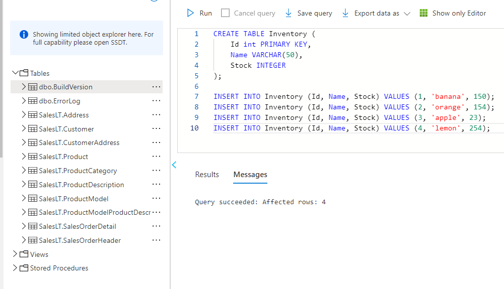
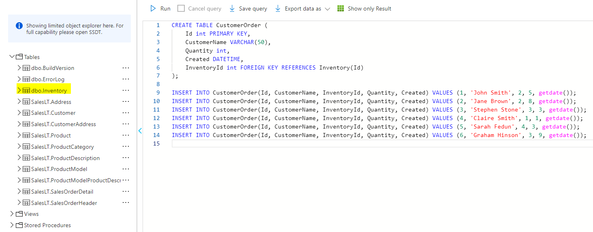
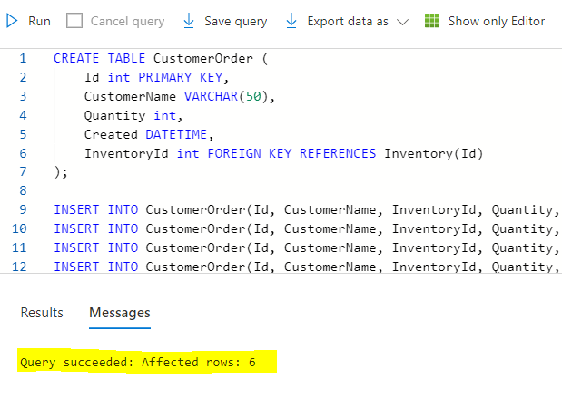
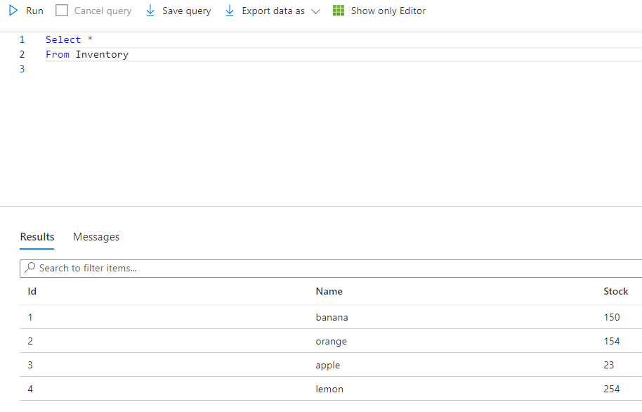
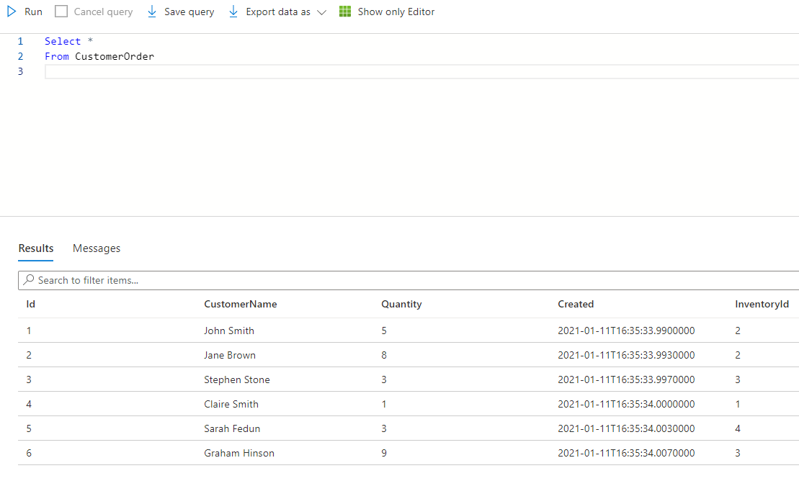
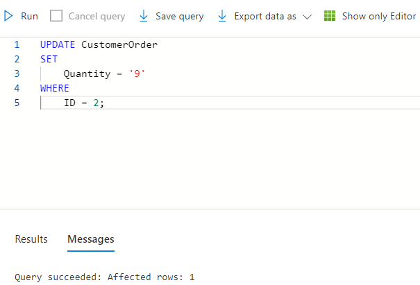
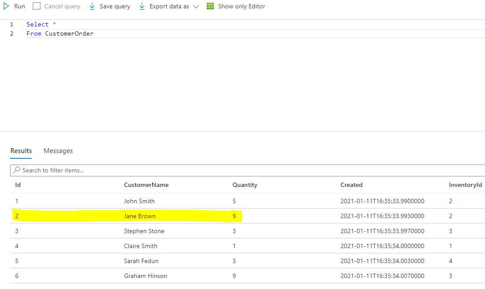
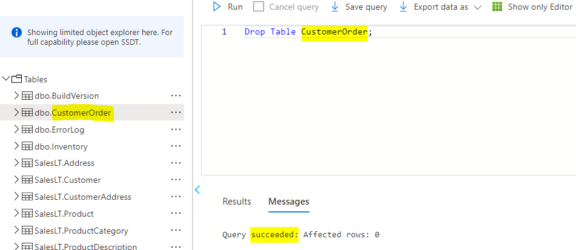
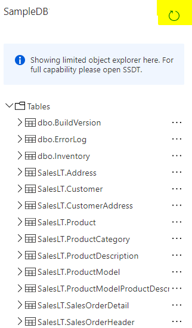

---
wts:
    title: '02 - Query an SQL database 25 min)'
    module: 'Module 02 - Explore relational data in Azure'
---

# 01 - Query an SQL database

In this walkthrough, we will run DDL and DML queries on an SQL database in Azure.

# Task 1: Create table (10 min)

In this task, we will create and populate a table in an SQL database using SQL query. 

1. Sign in to the Azure portal at [**https://portal.azure.com**](https://portal.azure.com).

2.From the **All services** blade, search and select **SQL databases** your database that was created. (You may need to **Refresh** the page.)

3. Click the **db1** entry representing the SQL database you created, and then click **Query editor (preview)**.
   
 


4. Login as **sqluser** with the password **Pa$$w0rd1234**.

5. Once you log in successfully the query pane appears, enter the following query into the editor pane.

    ```SQL
    CREATE TABLE Inventory (
	Id int PRIMARY KEY, 
	Name VARCHAR(50), 
	Stock INTEGER		);
```SQL
INSERT INTO Inventory (Id, Name, Stock) VALUES (1, 'banana', 150); 
INSERT INTO Inventory (Id, Name, Stock) VALUES (2, 'orange', 154);
INSERT INTO Inventory (Id, Name, Stock) VALUES (3, 'apple', 23); 
INSERT INTO Inventory (Id, Name, Stock) VALUES (4, 'lemon', 254); ```

6. Click **Run**, and then review the query results in the **Results** pane. The query should run successfully.



7. Once you have successfully created Inventory, create a second table by entering the following query into the editor pane.

    ```SQL
    CREATE TABLE CustomerOrder (
	Id int PRIMARY KEY, 
	CustomerName VARCHAR(50),
    Quantity int,
    Created DATETIME,
    InventoryId int FOREIGN KEY REFERENCES Inventory(Id)
);
```
Insert data 

```SQL

INSERT INTO CustomerOrder(Id, CustomerName, InventoryId, Quantity, Created) VALUES (1, 'John Smith', 2, 5, getdate());
INSERT INTO CustomerOrder(Id, CustomerName, InventoryId, Quantity, Created) VALUES (2, 'Jane Brown', 2, 8, getdate());
INSERT INTO CustomerOrder(Id, CustomerName, InventoryId, Quantity, Created) VALUES (3, 'Stephen Stone', 3, 3, getdate());
INSERT INTO CustomerOrder(Id, CustomerName, InventoryId, Quantity, Created) VALUES (4, 'Claire Smith', 1, 1, getdate());
INSERT INTO CustomerOrder(Id, CustomerName, InventoryId, Quantity, Created) VALUES (5, 'Sarah Fedun', 4, 3, getdate());
INSERT INTO CustomerOrder(Id, CustomerName, InventoryId, Quantity, Created) VALUES (6, 'Graham Hinson', 3, 9, getdate());   
```



8. Click **Run**, and then review the query results in the **Results** pane. The query should run successfully.


           

9. Once you have successfully created Customer Order table, run the following queries to view the data from tables created .

    ```SQL
Select * 
From Inventory    ```

           

And

    ```SQL
Select * 
From CustomerOrder    ```

       


# Task 2: Update and Delete a table (5 min)
In this task, we will run queries against the database in an SQL database using SQL query. 

1. Copy the following SQL statement into the editor. Select Run, to check everything is working. You should see a list of four inventory items


    ```SQL
SELECT * 
FROM Inventory    ```

2. Click **Run**, and then review the query results in the **Results** pane. The query should run successfully.


             
       
3. Replace the current SQL statement with the following statement to only show the number of bananas in stock:

    ```SQL
SELECT * 
FROM Inventory 
WHERE Name = 'banana'    ```
      
There should be 150 bananas.

      


5. Replace the SQL statement with the following statement to retrieve the inventory items in order of the quantity in stock:

    ```SQL
SELECT * 
FROM Inventory 
ORDER BY Stock    ```

       

6. Replace the SQL statement with the statement shown below. This statement is a query that uses the JOIN operator to combine data from the CustomerOrder table and the Inventory table. It lists the details of orders placed by customers together with the inventory information for each item ordered:


    ```SQL
SELECT * 
FROM Inventory 
JOIN CustomerOrder ON Inventory.Id = CustomerOrder.InventoryId    ```

             
       
7. Change the query to find the names of all customers who have ordered oranges.

    ```SQL
SELECT CustomerOrder.CustomerName 
FROM CustomerOrder
JOIN Inventory ON CustomerOrder.InventoryId = Inventory.ID
AND Inventory.Name = 'orange'    ```
      
This query should return two customers: John Smith and Jane Brown.

8. Find out how many customers have ordered lemons. This query uses the COUNT(*) function, which returns the number of rows that match the query criteria.

    ```SQL
SELECT COUNT(*) 
FROM CustomerOrder
JOIN Inventory ON CustomerOrder.InventoryId = Inventory.ID
AND Inventory.Name = 'lemon'    ```

The results of this query should indicate that only one customer has ordered lemons.

8. Which fruits has John Smith ordered?

    ```SQL
SELECT Inventory.Name 
FROM CustomerOrder
JOIN Inventory ON CustomerOrder.InventoryId = Inventory.ID
AND CustomerOrder.CustomerName = 'John Smith'    ```

The results of this query should show that John Smith has only ordered oranges.

9. What is the total quantity of items ordered by all customers? The Quantity column in the CustomerOrder table contains the quantity for each order. This query uses the SUM aggregate function to add the quantities together to product a grand total:

    ```SQL
SELECT SUM(CustomerOrder.Quantity) 
FROM CustomerOrder
JOIN Inventory ON CustomerOrder.InventoryId = Inventory.ID    ```

The answer should be 29.


# Task 3: Update and Delete a table (10 min)
In this task, we will update and delete a table in an SQL database using SQL query. 


1. Once you have successfully created the tables, run the following queries to UPDATE the CustomerOrder table.

    ```SQL
UPDATE CustomerOrder
SET 
    Quantity = '9'
WHERE
    ID = 2;    ```

2. Click **Run**, and then review the query results in the **Results** pane. The query should run successfully.


             
       
3. Once you have successfully updated CustomerOrder table, run the following queries to view the changes.

    ```SQL
Select * 
From CustomerOrder    ```

4. Click **Run**, and then review the query results in the **Results** pane. The query should run successfully.


       

5. Once you have successfully updated a table, run the following queries to Delete a table.

    ```SQL
Drop Table CustomerOrder;
    ```

6. Click **Run**, and then review the query results in the **Results** pane. The query should run successfully.


       

7. Click **refresh icon**, and then review the tables. You should no longer be able to see CustomerOrder in the list.
       


Congratulations! You have successfully queried the data using SQL.

**Ignore**: If you are completing further SQL Labs, **Ignore** the following note.

**Note**: To avoid additional costs, you can remove this resource group. Search for resource groups, click your resource group, and then click **Delete resource group**. Verify the name of the resource group and then click **Delete**. Monitor the **Notifications** to see how the delete is proceeding.

